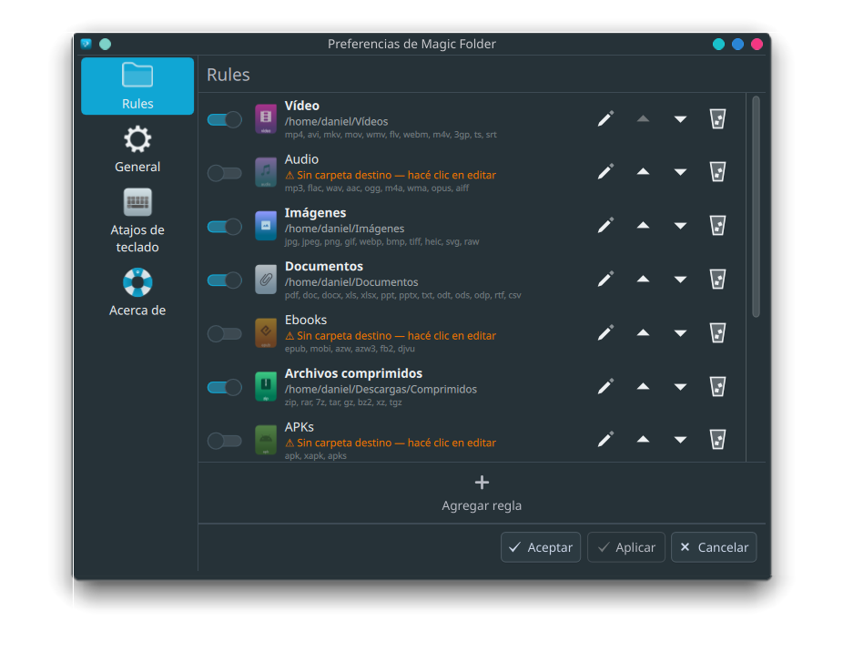
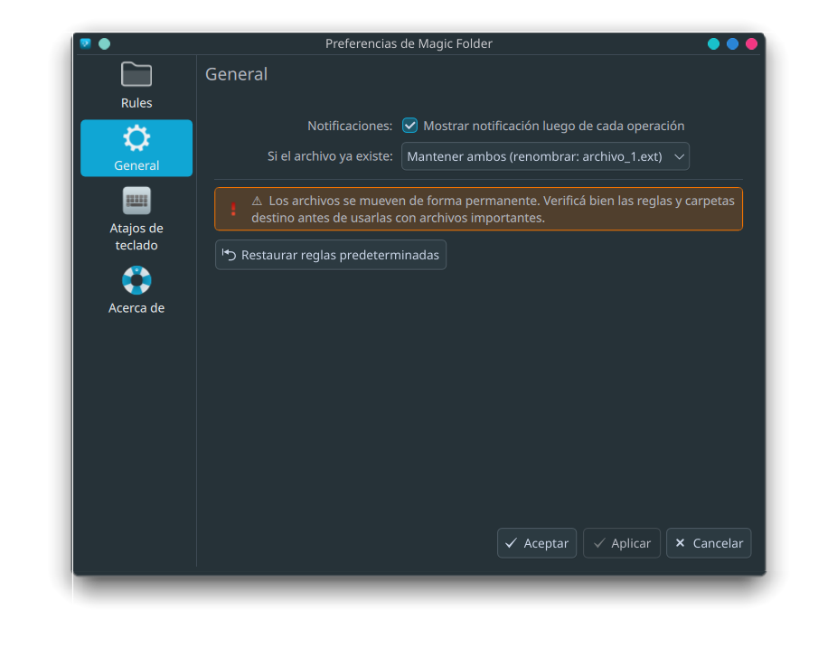

# Magic Folder

Widget para el panel de KDE Plasma 6 que mueve archivos automáticamente a carpetas predefinidas al soltarlos sobre el ícono — una reimplementación moderna del clásico Magic Folder de Plasma 4.


---

## Características

- 📂 **Drag & drop** de archivos sobre el ícono del panel para ordenarlos al instante
- 📋 **9 categorías predefinidas** — Vídeo, Audio, Imágenes, Documentos, Ebooks, Comprimidos, APKs, Código fuente, Binarios
- ✏️ **Editor gráfico de reglas** — agregá, editá, reordenás y eliminás reglas sin tocar ningún archivo de configuración
- 🔔 **Notificaciones nativas de KDE** mostrando qué archivos se movieron y a dónde
- ⚖️ **Manejo de conflictos** — mantener ambos (renombrado automático), omitir o sobreescribir
- 🔒 Los archivos sin regla coincidente se dejan en su lugar

## Capturas de pantalla




---

## Requisitos

| Dependencia | Paquete (Debian/Ubuntu) | Notas |
|---|---|---|
| KDE Plasma 6.0+ | — | Requerido |
| plasma5support | `plasma5support` | Requerido para ejecución de comandos |
| notify-send | `libnotify-bin` | Requerido para notificaciones |
| kpackagetool6 | `plasma-sdk` | Requerido para instalación |

---

## Instalación

### Desde el release

Descargá el último `magic-folder.plasmoid` desde la página de [Releases](../../releases) y ejecutá:

```bash
kpackagetool6 -t Plasma/Applet --install magic-folder.plasmoid
```

### Desde el código fuente

```bash
git clone https://github.com/osdaeg/magic-folder.git
cd magic-folder
kpackagetool6 -t Plasma/Applet --install .
```

Luego **clic derecho en el panel → Agregar widgets → buscá "Magic Folder"** y arrastralo al panel.

### Reinstalar / actualizar

```bash
rm -rf ~/.local/share/plasma/plasmoids/org.kde.plasma.magicfolder
kpackagetool6 -t Plasma/Applet --install magic-folder.plasmoid
plasmashell --replace &
```

---

## Uso

1. Agregá el widget al panel
2. Clic derecho sobre el ícono → **Configurar Magic Folder**
3. En la pestaña **Rules**, hacé clic en el lápiz de cualquier categoría y asignale una carpeta destino
4. La regla se activa automáticamente una vez que tiene destino asignado
5. Soltá archivos sobre el ícono del panel — ¡listo!

### Evaluación de reglas

Las reglas se evalúan **de arriba hacia abajo** — gana la primera coincidencia. Podés reordenarlas con los botones de flechas.

Los archivos que no coinciden con ninguna regla activa se dejan en su lugar y aparecen con `?` en la notificación.

### Categorías predefinidas

| Categoría | Extensiones |
|---|---|
| Vídeo | mp4, avi, mkv, mov, wmv, flv, webm, m4v, 3gp, ts |
| Audio | mp3, flac, wav, aac, ogg, m4a, wma, opus, aiff |
| Imágenes | jpg, jpeg, png, gif, webp, bmp, tiff, heic, svg, raw |
| Documentos | pdf, doc, docx, xls, xlsx, ppt, pptx, txt, odt, ods, odp, rtf, csv |
| Ebooks | epub, mobi, azw, azw3, fb2, djvu |
| Archivos comprimidos | zip, rar, 7z, tar, gz, bz2, xz |
| APKs | apk, xapk, apks |
| Código fuente | py, sh, bash, c, cpp, h, kt, java, js, ts, html, json, sql, go, rs… |
| Binarios | exe, msi, deb, rpm, appimage, run, bin, elf, dll, jar… |

---

## Configuración

### Manejo de conflictos

Configurable desde la pestaña **General**:

| Opción | Comportamiento |
|---|---|
| Omitir | Deja el archivo en su lugar si ya existe uno con el mismo nombre en el destino |
| **Mantener ambos** _(por defecto)_ | Renombra automáticamente: `archivo.ext` → `archivo_1.ext` → `archivo_2.ext`… |
| Sobreescribir | Reemplaza el archivo existente sin aviso |

---

## Desinstalar

```bash
kpackagetool6 -t Plasma/Applet --remove org.kde.plasma.magicfolder
```

---

## Solución de problemas

**El widget no aparece en el catálogo después de instalar**
```bash
plasmashell --replace &
```

**No aparecen notificaciones**
Verificá que `libnotify-bin` esté instalado:
```bash
sudo apt install libnotify-bin
# Probá manualmente:
notify-send "Prueba" "Hola"
```

**Error de DBus al instalar** (`Invalid object path: /KPackage/`)
Es un bug cosmético conocido de Plasma 6 — la instalación se realiza correctamente de todas formas.

**Ver errores en tiempo real**
```bash
journalctl --user -f | grep plasmashell
```

---

## Licencia

GPL-3.0-or-later
